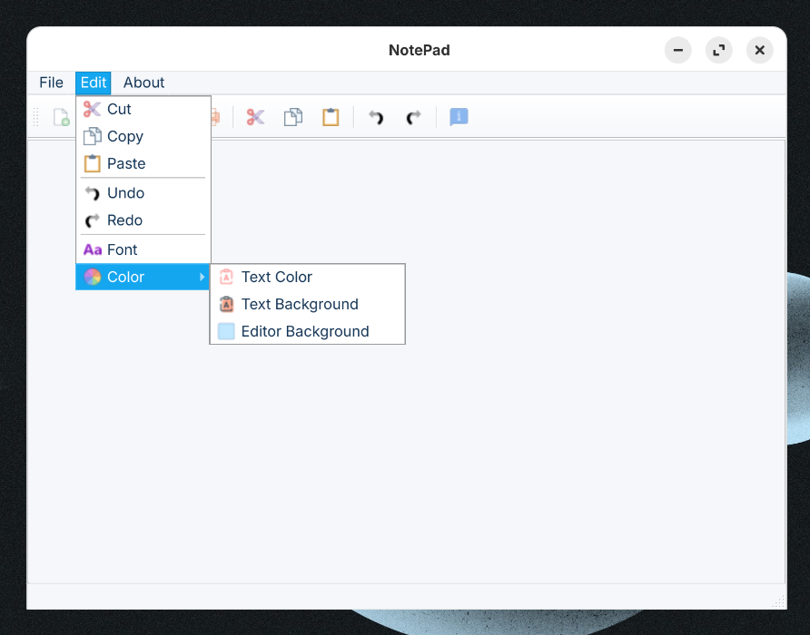
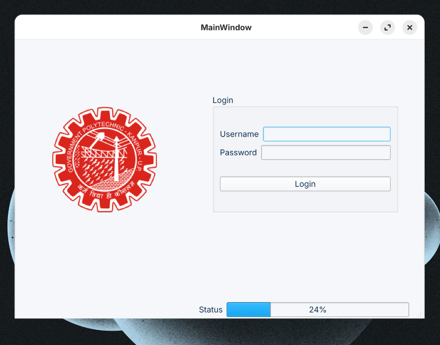
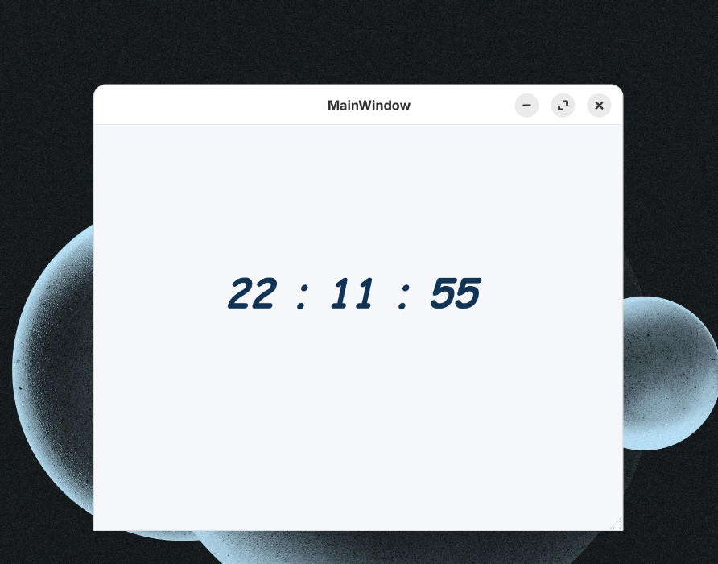
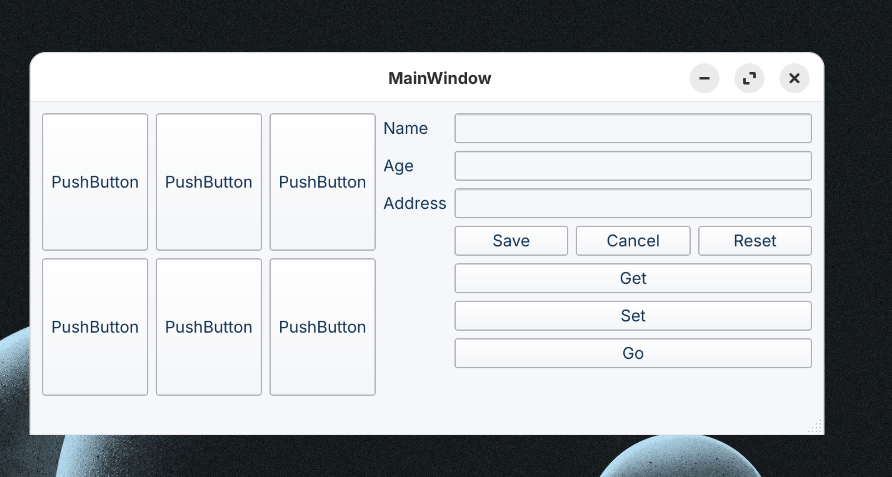

# QT Practice 

Qt is a cross-platform application development framework widely used for creating graphical user interfaces (GUIs) and applications that run on various operating systems and hardware platforms.

  

  

### What I learn here...

   

        
        
    

   

        
        
    

 

  

🔋 I need to review my programs for a quick revision.

